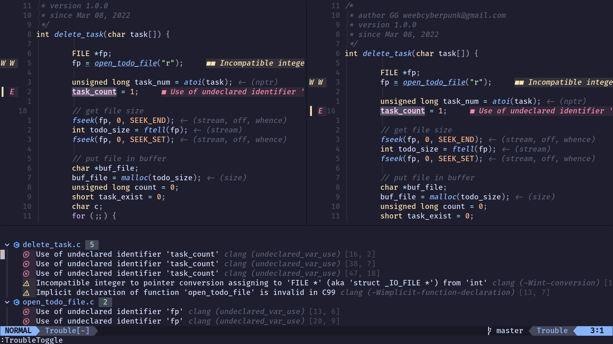
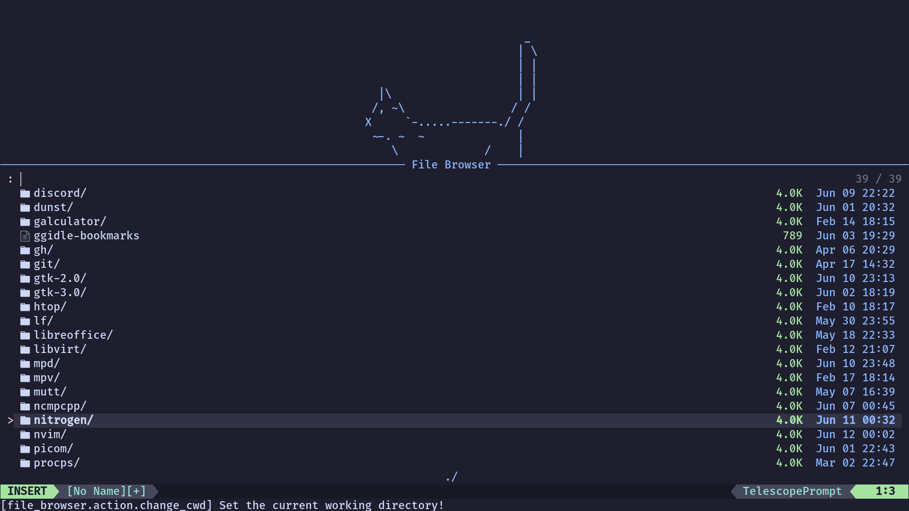
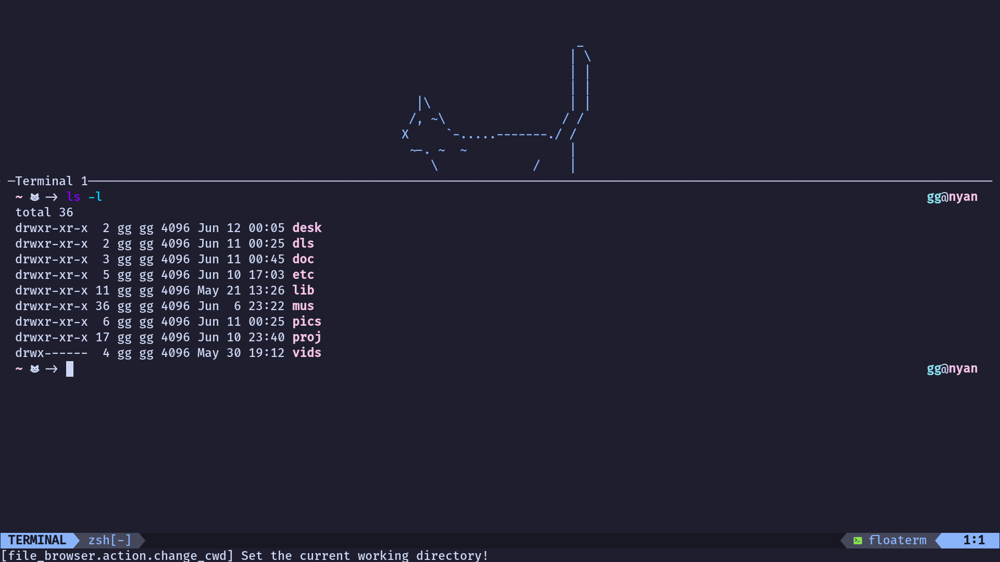

# NyanVim

NyanVim is my personal config that make NeoVim became my own IDE.

Current features:  
- LSP integration, specially designed for use with Rust, Python and C.  
- Autocomplete.  
- Better highlight with TreeSitter.  
- Git integration.  
- Tests integration.  
- General IDE features: auto-closing brackets and HTML tags, indent help, etc.  
- Easy terminal management with support for multiple terminals running at the
  same time, inside NeoVim.  
- Zen and pencil mode for writing documents.  
- Prettiness (default theme: [catppuccin](https://github.com/catppuccin/nvim).
  Looks amazing inside [my custom DWM
  desktop](https://github.com/weebcyberpunk/ggidle)).  
- Tetris.  
- Cute cats and anime girls.  

#### Notes

This is my personal config, so, of course, many things are just my preference.
If you gonna use NyanVim, you may want to change somethings, for example, the
snippets that I use to automatically sign my code. Also, mind that the config is
only one huge Lua file. I try to keep it organized, but it may be difficult to
find your way inside it.

## Installing and Bootstraping

The config file have settings to start a bootstrap process of the [Packer
package manager](https://github.com/wbthomason/packer.nvim), so you do not have
to install it manually. The first time you run NeoVim with the NyanVim config,
it'll automagically install Packer and all required plugins.

You can install the entire repository as `~/.config/nvim` so you can run a `git
pull` to keep in sync with my updates, or you can install just the `init.lua`
file as `~/.config/nvim/init.lua`. Packer bootstrap should work anyway, but you
will not be able to use my snippets if installing only the `init.lua` file.

### Known bugs

Packer used to fail to run the command needed to update the TreeSitter parsers,
so that has been removed from the config, so you will need to run it manually to
install and update them (`:TSUpdateSync`) everytime TreeSitter is updated.

## LSP and autocomplete

LSP integration is configured for C/C++, Python and Rust. Of course, you need
the language server installed on your machine. It's easy to add support for
other server, just adding one line in the config. Some keybinds are defined for
LSP-related things:

- `C-d`: See workspace diagnostics with
  [Trouble](https://github/folke/trouble.nvim)  
- `C-s`: Find references to whatever is under the cursor.  

Autocomplete is done with cmp. Defaults should work well.  

Plugins:  
- [cmp](https://github.com/hrsh7th/nvim-cmp): Autocompletion engine.  
- [LSP Config](https://github.com/neovim/nvim-lspconfig): NeoVim common configs
  for language servers.  
- [Lua Snips](https://github.com/L3MON4D3/LuaSnip): Snippets source for
  cmp.  
- [Rust Tools](https://github.com/simrat39/rust-tools.nvim): Improvements on
  Rust programming.  
- [Clangd
  Extensions](https://github.com/p00f/clangd_extensions.nvim): Improvements on
  using the Clangd server with NeoVim.  
- To get the most from cmp, a bunch of dependencies are used. See all of them in
  `init.lua`.  

## TreeSitter

The [TreeSitter](https://github.com/tree-sitter/tree-sitter) is a parser
generator tool that we can use via [the TreeSitter plugin for
NeoVim](https://github.com/nvim-treesitter/nvim-treesitter) to have a better
syntax highlighting inside NyanVim. Parsers are language-specific, and you can
add more adding the parser name to the array in the following line inside
TreeSitter configs on `init.lua`:

	ensure_installed = { "c", "python", "rust", "bash", "lua", "html", "markdown" },

## Git integration

Git integration is done three times:

- [Fugitive](https://github.com/tpope/vim-fugitive): A Git wrapper so awesome it
  should be illegal. Written in VimScript by tpope. Spawned with the `:G`
  command.  
- [Git Signs](https://github.com/lewis6991/gitsigns.nvim): Shows Git diff in the
  signcolumn *jUsT lIkE vS cOdE* and current line blame (disabled by default in
  NyanVim). Also helps on staging/unstaging hunks.  
- [Telescope Git files](https://github.com/nvim-telescope/telescope.nvim):
  Telescope is a filer plugin that happens to have a mode to show Git tracked
  files. This mode is accessible in NyanVim with the `C-f` keybind.

## Running tests

Testing is done with the awesome
[Dispatch](https://github.com/tpope/vim-dispatch). You can use `:Make` or
`:Dispatch` to launch it.

## General IDE features:

General "must-have" IDE features:

- [Matchem](https://github.com/ervandew/matchem): The only auto-close plugin
  that did not failed with me. Written in VimScript by ervandew.  
- [TS Autotag](https://github.com/windwp/nvim-ts-autotag): Auto-close HTML tags.
  Needs the HTML TreeSitter parser to work (installed by default in NyanVim).  
- [Indent Blankline](https://github.com/lukas-reineke/indent-blankline.nvim):
  Plugin to show indentation helps. *JuSt LiKe Vs CoDe*.  

### File browsing

For file browsing, NyanVim uses the [file
browser](https://github.com/nvim-telescope/telescope-file-browser.nvim)
Telescope plugin. Accessible anytime with `C-n` and in the start screen with
just `n`.

Also, you can navigate between the Git-tracked files with `C-f` and, if you need
to do more intensive file-managing tasks, you can open a terminal with lf with
`C-c f` (see more in Terminal section).

## Terminal

Terminal is managed with [Floaterm](https://github.com/voldikss/vim-floaterm).
The keybinds are:

- `C-t`: Toggles the terminal. If no terminal running, creates a new one.  
- `C-c n`: Creates a new terminal.  
- `C-c l`: Toggle the next terminal.  
- `C-c h`: Toggle the previous terminal.  
- `C-c p`: Creates a new terminal with a Python repl (of course you can change
  to your favorite interactive language. I like Python!).  
- `C-c f`: Creates a new terminal with
  a [lf](https://github.com/gokcehan/lfgokcehan/lf) client. Of course, needs you
  to have lf installed on your machine.  

## NyanVim as a tool to write text

NyanVim uses the [folke's zen mode
plugin](https://github.com/folke/zen-mode.nvim) to provide distraction-free
writing. Awesome if used in a full-screen terminal! Folke's zen mode plugin
creates a floating window with your buffer, so it do not mess up with your other
windows. To toggle it, simply `:ZenMode`.

Also, NyanVim uses the amazing [Vim
Pencil](https://github.com/preservim/vim-pencil) plugin to provide automagically
wrapping on Markdown, HTML, Groff and whatever document you toggle the plugin
(with `:HardPencil` and other variations, see `:h vim-pencil`). Needs some time
to get used to. Perfect if used with zen mode!

## Prettiness

NyanVim is pretty and cute. It features a custom startup screen with
[alpha](https://github.com/goolord/alpha-nvim). The ascii is configured directed
in `init.lua` at the "alpha dashboard" section. You can uncomment the desired
one or add your own. The colorscheme is
[catppuccin](https://github.com/catppuccin/nvim) and the statusbar (with Git and
LSP integration) is the awesome
[LuaLine](https://github.com/nvim-lualine/lualine.nvim). Also, icons are
provided by [Web devicons](https://github.com/kyazdani42/nvim-web-devicons).

## Tetris

The best Emacs feature but without Emacs, directly inside NeoVim! `:Tetris`.
Uses [this Tetris plugin](https://github.com/alec-gibson/nvim-tetris).

## Other cool tools

Other plugins featured in NyanVim are:

- [Table Mode](https://github.com/dhruvasagar/vim-table-mode): Toggled with
  `<leader>tm`, makes creating ascii tables much, much easy.  
- [Commentary](https://github.com/tpope/vim-commentary): Another tpope's
  VimScript masterpiece, creates extremally useful normal-mode keybinds to
  comment in and out lines.  
- [Colorizer](https://github.com/norcalli/nvim-colorizer.lua): Highlight the
  background of colors like "Blue" or #ffffff.  

## Keybinds

Just a few keybinds are remapped:  
- `C-h`: Changes to the left window (why this isn't the default?).  
- `C-l`: Same but right.  
- `C-k`: Same but above.  
- `C-j`: Same but under.  
- `Space Space`: Finds the next occurrance of '++', erases it and enter insert
  mode. Extremally usefull.  
- `si`: Splits vertically.  
- `su`: Splits horizontally.  

Common keybinds:  
- `C-n`: Opens Telescope file browser.  
- `C-d`: Opens Trouble diagnostics.  
- `C-s`: Opens Telescope references.  
- `C-f`: Opens Telescope Git filer.  

Terminal keybinds:  
- `C-t`: Toggles the terminal. If no terminal running, creates a new one.  
- `C-c n`: Creates a new terminal.  
- `C-c l`: Toggle the next terminal.  
- `C-c h`: Toggle the previous terminal.  
- `C-c p`: Creates a new terminal with a Python repl  
- `C-c f`: Creates a new terminal with
  a [lf](https://github.com/gokcehan/lfgokcehan/lf) client. Of course, needs you
  to have lf installed on your machine.  

Snippets keybinds (only works if installing `snippets` folder too. Remember that
they were build by me for me so you will need to change them a little):  
- `;c`: creates a C function declaration with the filename as function name, my
  sign, `#include` `stdio.h`, `stdlib.h`, `errno.h` and returning `errno`.  
- `;ds`: writes my sign using `#` as the comment character, for using mainly
  with Python and Shell.  
- `;mitc`: writes the MIT license with C comment characters.  
- `;mits`: writes the MIT license with `#` as the comment character.  
- `;mitt`: just writes the MIT license with no comment character.
